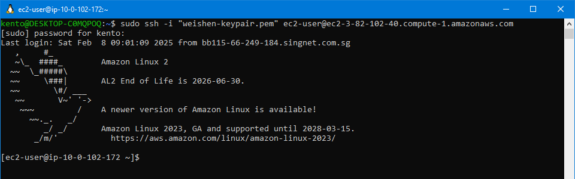
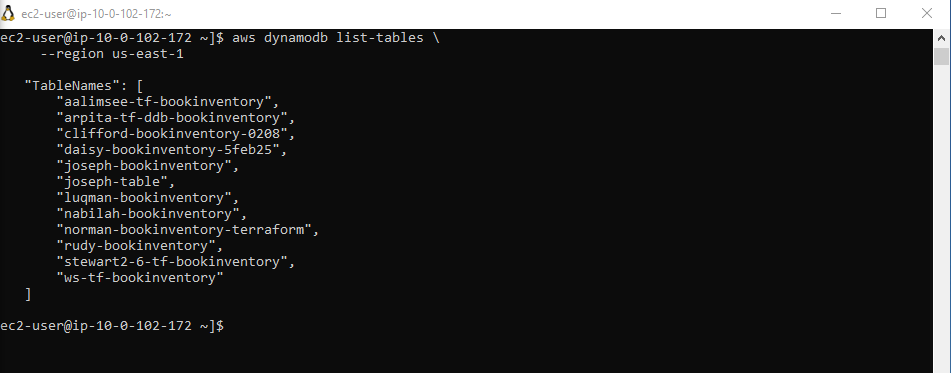
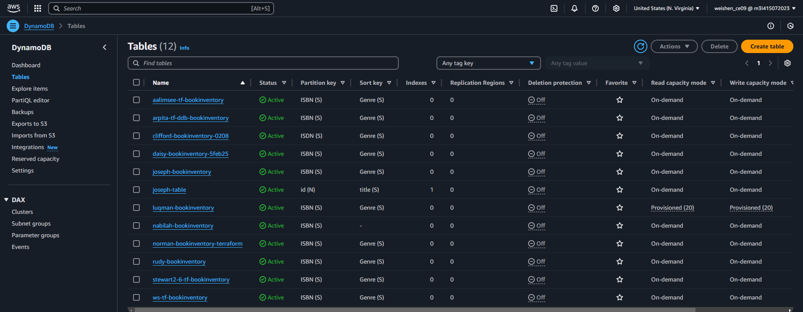
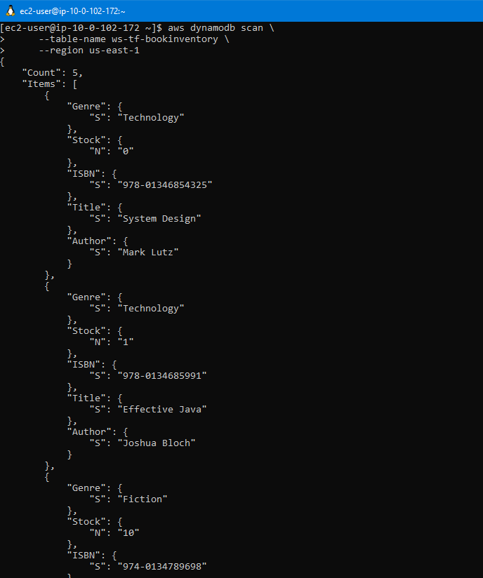
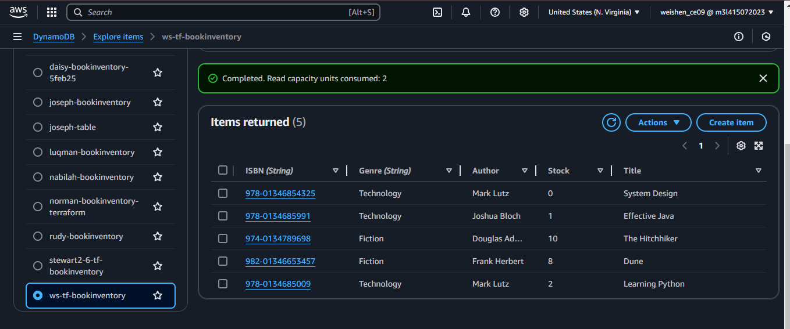

# IAM-Role-and-Policy

Validate:
1. SSH into EC2

2. Validate permission to list table
aws cli code:

aws dynamodb list-tables \
    --region us-east-1

Terminal Outcome:

AWS console Outcome:

3. Valdiate permission to scan table
aws dynamodb scan \
     --table-name ws-tf-bookinventory \
     --region us-east-1
     --exclusive-start-key "LastEvaluatedKeyHere"

Terminal outcome: 

AWS Console Outcome:

